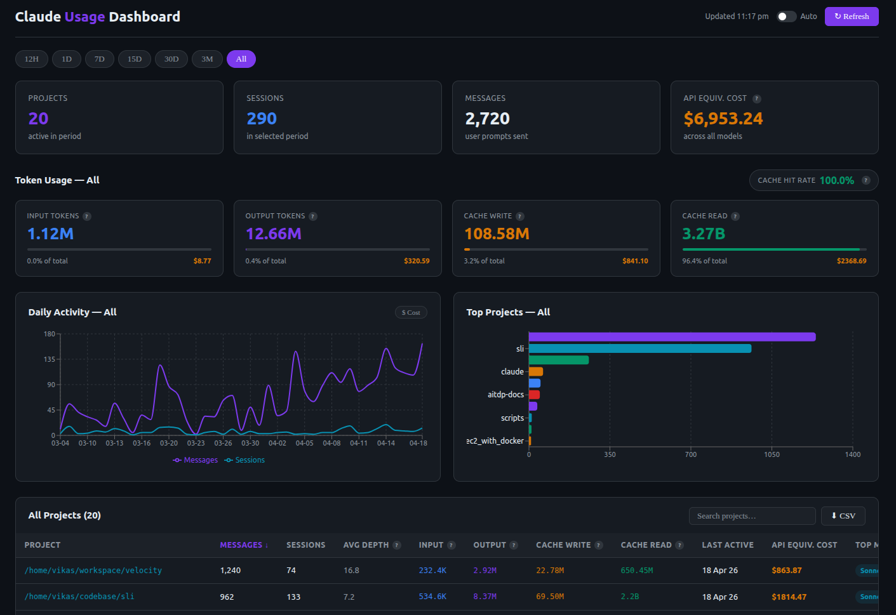

# 📊 ccusage

> **Your Claude Code usage, beautifully visualized — right on your machine.**

Track every token, every cost, every project. Fully offline. No API key. No cloud. Just your data.


🔗 [GitHub](https://github.com/vikas9dev/ccusage) · 🐳 [Docker Hub](https://hub.docker.com/r/vikas9dev/ccusage)

---

## 🖼️ Screenshot



---

## ✨ Features

| | Feature | Details |
|---|---|---|
| 🗂️ | **Per-project breakdown** | Input / Output / Cache Write / Cache Read tokens |
| 💰 | **Cost estimation** | API-equivalent cost across Opus, Sonnet & Haiku |
| 🕐 | **Period filters** | 12H · 1D · 7D · 15D · 30D · 3M · All-time |
| ⚡ | **Cache hit rate** | See exactly how much you save via prompt caching |
| 📈 | **Activity charts** | Daily & hourly views with cost-per-day toggle |
| 🧠 | **Conversation depth** | Avg message depth per project |
| 🏷️ | **Model mix badges** | Opus / Sonnet / Haiku usage per project |
| 🔍 | **Project search** | Instantly filter across all your projects |
| 📥 | **CSV export** | Download your full usage data |
| 🔄 | **Auto-refresh** | Live updates every 30 seconds |

---

## 🚀 Quick Start — Docker *(recommended)*

### 🐧 Linux / 🍎 macOS

```bash
docker run -d \
  --name ccusage \
  -p 9001:9001 \
  -v ~/.claude:/claude-data:ro \
  -e CLAUDE_DATA_DIR=/claude-data \
  vikas9dev/ccusage:latest
```

### 🪟 Windows — PowerShell

```powershell
docker run -d `
  --name ccusage `
  -p 9001:9001 `
  -v "$env:USERPROFILE\.claude:/claude-data:ro" `
  -e CLAUDE_DATA_DIR=/claude-data `
  vikas9dev/ccusage:latest
```

### 🪟 Windows — CMD

```cmd
docker run -d ^
  --name ccusage ^
  -p 9001:9001 ^
  -v "%USERPROFILE%\.claude:/claude-data:ro" ^
  -e CLAUDE_DATA_DIR=/claude-data ^
  vikas9dev/ccusage:latest
```

Then open 👉 **http://localhost:9001**

---

## 🐙 Docker Compose

Create a `docker-compose.yml` anywhere and run `docker compose up -d`:

```yaml
services:
  ccusage:
    image: vikas9dev/ccusage:latest
    ports:
      - "9001:9001"
    volumes:
      - "${CLAUDE_DATA_DIR:-~/.claude}:/claude-data:ro"
    environment:
      - CLAUDE_DATA_DIR=/claude-data
    restart: unless-stopped
```

> 💡 **Windows users:** replace `~/.claude` with `C:\Users\<YourName>\.claude` in the volumes line, or set `CLAUDE_DATA_DIR` as an environment variable before running.

```bash
docker stop ccusage && docker rm ccusage   # 🛑 stop & remove
```

---

## 🛠️ Local Development *(without Docker)*

### Prerequisites

- 🐍 Python 3.11+
- 🟢 Node.js 18+

### Setup & Run

```bash
git clone https://github.com/vikas9dev/ccusage
cd ccusage
cd frontend && npm install && cd ..
bash start.sh      # 🚀 starts backend + frontend
```

| Service | URL |
|---|---|
| 🔧 Backend API | http://localhost:9001 |
| 🎨 Frontend UI | http://localhost:5173 |

```bash
bash stop.sh       # 🛑 stop both
bash restart.sh    # 🔁 restart both
```

### ⚙️ Configuration

Copy and edit `.env` *(optional — defaults work out of the box)*:

```env
BACKEND_PORT=9001
FRONTEND_PORT=5173
CLAUDE_DATA_DIR=~/.claude
```

---

## 🏗️ Build Your Own Docker Image

```bash
# 🔨 Build
docker build -t ccusage .

# ▶️ Run locally
docker run -d \
  --name ccusage \
  -p 9001:9001 \
  -v ~/.claude:/claude-data:ro \
  -e CLAUDE_DATA_DIR=/claude-data \
  ccusage
```

### 📤 Push to Docker Hub

```bash
docker login
docker tag ccusage vikas9dev/ccusage:latest
docker tag ccusage vikas9dev/ccusage:1.0.0
docker push vikas9dev/ccusage:latest
docker push vikas9dev/ccusage:1.0.0
```

### 🌐 Multi-platform Build *(Intel + Apple Silicon)*

```bash
# One-time setup
docker buildx create --use --name multiarch

# Build & push amd64 + arm64 simultaneously
docker buildx build \
  --platform linux/amd64,linux/arm64 \
  -t vikas9dev/ccusage:latest \
  -t vikas9dev/ccusage:1.0.0 \
  --push .
```

---

## 🔍 How It Works

ccusage reads three local files written by Claude Code — nothing leaves your machine:

| 📄 File | What it provides |
|---|---|
| `~/.claude/history.jsonl` | Per-message project + session timestamps |
| `~/.claude/projects/<dir>/*.jsonl` | Token usage per session (deduplicated by message ID) |
| `~/.claude/stats-cache.json` | All-time global aggregates (sessions, messages, model totals) |

> 💡 Cost shown is **API equivalent cost** — what your usage would cost on pay-per-token billing. If you're on a flat subscription, your actual charge is your monthly plan fee.

---

## 💵 Pricing Reference

| Model | Input | Output | Cache Write | Cache Read |
|---|---|---|---|---|
| 🟣 Claude Opus 4 | $15/M | $75/M | $18.75/M | $1.50/M |
| 🔵 Claude Sonnet 4.6 | $3/M | $15/M | $3.75/M | $0.30/M |
| 🟢 Claude Haiku 4.5 | $0.80/M | $4/M | $1.00/M | $0.08/M |

*Prices per million tokens. Source: [Anthropic pricing](https://www.anthropic.com/pricing)*

---

## 🔧 Environment Variables

| Variable | Default | Description |
|---|---|---|
| `CLAUDE_DATA_DIR` | `~/.claude` | 📁 Path to your Claude Code data directory |
| `BACKEND_PORT` | `9001` | 🔌 Port for the backend API and frontend |
| `FRONTEND_PORT` | `5173` | 🎨 Frontend dev server port *(local dev only)* |

---

## 📜 License

MIT © [vikas9dev](https://github.com/vikas9dev)
